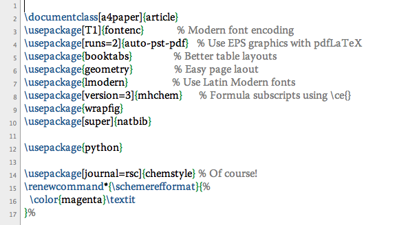

# {{ $page.frontmatter.title }}

{{ $page.frontmatter.date | moment("from", "now") }}

*Instructions to make TeXShop's color scheme more... acceptable.*

TeXShop has default font and colors that is not conducive to long stretches of writing.  A more subdued color scheme, and a serif font, makes it much more pleasant to look at:

Font selection is contained in _Preferences_.  Color change, however, requires going into command line (Terminal, A):

The color scheme in the diagram is achieved with the following lines:

> defaults write TeXShop commentred 0.4 defaults write TeXShop commentgreen 0.4 defaults write TeXShop commentblue 0.4 defaults write TeXShop commandred 0.09 defaults write TeXShop commandgreen 0.28 defaults write TeXShop commandblue 0.51

Thanks to amychr for reporting on the [syntax](http://amychr.wordpress.com/2007/08/10/texshop-color-highlighting-may-we-have-other-colors-please/ "TeXShop Coloring scheme").

## Comments from WordPress

*  **Volodymyr** 2010-12-11T07:06:26Z
  > Could you please tell me what font you are using in the screenshot?
*  **[toeholds](http://toeholds.wordpress.com)** 2010-12-12T00:17:32Z
  > I'm not sure.  I commonly use helvetica or myriad for sans serif, but in the screenshot it's neither.  I now use TextMate for both LaTeX and code, and a variable width like that in screenshot is no good for the latter.
*  **[toeholds](http://toeholds.wordpress.com)** 2010-12-12T00:21:26Z
  > I looked through my font book... it's good ol' "MS Sans Serif".
*  **Volodymyr** 2010-12-13T07:27:38Z
  > I was asking about the serif font in the second code listing. Thanks!
*  **[toeholds](http://toeholds.wordpress.com)** 2010-12-13T18:18:02Z
  > Ah, that is Adobe Warnock Pro.  If you're writing code/LaTeX, you may also want to try Inconsolata - it's like a fixed-width Arial / Arial Narrow that is pleasant to read and write with.

<!-- * **[Subdued TeXShop Color Scheme &#8211; media and arts technology](http://qmat.net/2011/06/subdued-texshop-color-scheme/)** 2011-06-12T11:17:11Z
  > [...] via Subdued TeXShop Color Scheme | Jon Chui. [...]
* **[Change TeXShop Font Colours | Ossido di Carbonio](http://coflower.wordpress.com/2011/10/27/change-texshop-font-colours/)** 2011-10-27T02:47:54Z
  > [...] also this page. Like this:LikeBe the first to like this post.   This entry was posted in Tools and tagged LaTeX, [...]
*  **Universal Logic** 2015-10-26T10:52:00Z
  > # Safari Reader Night Theme
  > 
  > # background = 39 40 34 (#272822)
  > 
  > defaults write TeXShop background_R 0.05
  > 
  > defaults write TeXShop background_G 0.06
  > 
  > defaults write TeXShop background_B 0.03
  > 
  > # commands = 102 217 239 (#66D9EF)
  > 
  > defaults write TeXShop commandred 0.3
  > 
  > defaults write TeXShop commandgreen 0.70
  > 
  > defaults write TeXShop commandblue 0.93
  > 
  > # comments = 117 113 94 (#75715E)
  > 
  > defaults write TeXShop commentred 0.46
  > 
  > defaults write TeXShop commentgreen 0.44
  > 
  > defaults write TeXShop commentblue 0.36
  > 
  > # foreground = 248 248 242 (#F8F8F2)  
  > 
  > defaults write TeXShop foreground_R 0.71
  > 
  > defaults write TeXShop foreground_G 0.71
  > 
  > defaults write TeXShop foreground_B 0.71
  > 
  > # index = 253 151 31 (#FD971F)
  > 
  > defaults write TeXShop indexred 0.99
  > 
  > defaults write TeXShop indexgreen 0.59
  > 
  > defaults write TeXShop indexblue 0.12
  > 
  > # marker = 73 72 62 (#E6DB74)
  > 
  > defaults write TeXShop markerred 0.90 
  > 
  > defaults write TeXShop markergreen 0.86
  > 
  > defaults write TeXShop markerblue 0.45
  > 
  > # insertionpoint = 248 248 240 (#F8F8F0)
  > 
  > defaults write TeXShop insertionpoint_R 0.97
  > 
  > defaults write TeXShop insertionpoint_G 0.97
  > 
  > defaults write TeXShop insertionpoint_B 0.94
  > 
  > # highlighted background = 73 72 62 (#49483e)
  > 
  > defaults write TeXShop highlightContentRed 0.27 
  > 
  > defaults write TeXShop highlightContentGreen 0.29
  > 
  > defaults write TeXShop highlightContentBlue 0.24
  > 
  > # highlighted brace color = 249 38 114 (#f92672)
  > 
  > defaults write TeXShop highlightBracesRed 0.98
  > 
  > defaults write TeXShop highlightBracesGreen 0.15
  > 
  > defaults write TeXShop highlightBracesBlue 0.45 -->
