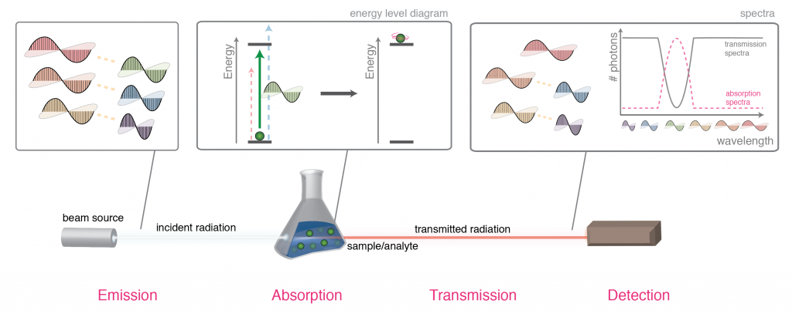
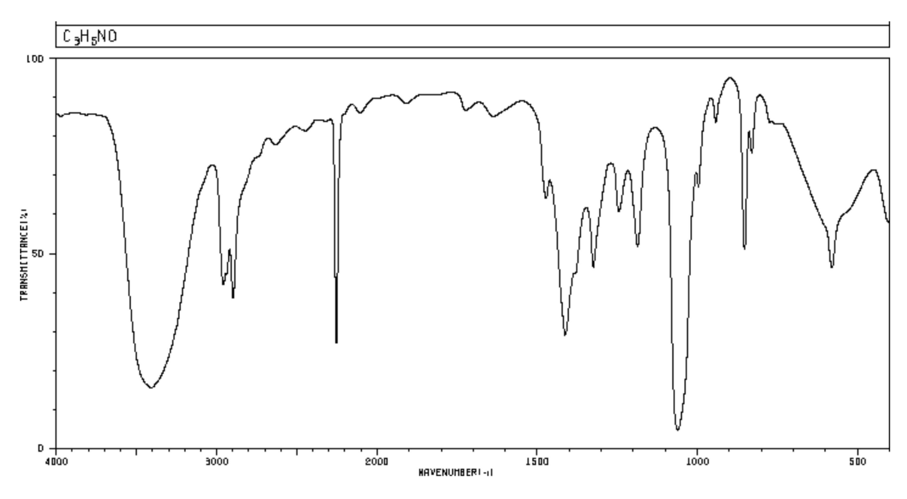

# {{ $page.frontmatter.title }}

{{ $page.frontmatter.date | moment("from", "now") }}

<Duration time='60 min' />

You can find here [a folder of material](https://drive.google.com/drive/folders/1Jht-cX9MR_zSDMRWnSn796n8fM1k8yRm?usp=sharing) I use to introduce IR spectra interpretation in a 60-70 min mixed SL/HL class.  It is tactically hyper-efficient but structurally sub-optimal: splitting this into two or three sessions of shorter duration could possibly be better.[^defense]

[^defense]: In my defense, I sometimes need to teach a 240 hr syllabus in 150 hours; I can have my kids for an extra _year_ and we would still not make 240!

<mermaid>
graph LR
  subgraph 10. Organic
    O0("Functional group identification") --> Sp1("Index of Hydrogen Deficiency")
  end
  subgraph 11B. Spectroscopy
    Sp1 --> IR("Infrared Spectra Interpretation")
    O0 --> NMR("NMR")
    IR --> NMR
  end
</mermaid>

Sequence-wise, I teach 10 (organic chem) -> Index of Hydrogen Deficiency -> **IR** -> 20 -> NMR.  I find IHD a generally useful tool that complements structure determination.  The spectra <=> structure relationship is simpler in IR and is thus a useful lead-in to ^1^H NMR.

::: tip Syllabus changes

The previous (2008-2015) syllabus have IR spectroscopy in an Option (A - Analytic Chem).  

1. Theory of IR spectroscopy, and 
2. working of spectrometer
   
were part of the syllabus.  The current syllabus do not require either of these.

:::

## Lesson overview

<mermaid>
graph LR
 subgraph Activation
    CL1("Spectroscopy (5 min)") --> CL2("FG review (10 min)")
    CL2 --> CL3("First pass at spectra (7 min)")
  end
  subgraph Learning
    CL3 --> CL4("Comics (3 min)")
    CL4 --> CL5("Informed pass (2/3 ppl, 15 min)")
  end
  subgraph Practice
    CL5 --> CL6("13x13 matching (25 min)")
  end
</mermaid>

## Activation

### Spectroscopy

In this intro class, I first set the context with general idea of spectroscopy (5 min).  My hook is usually, "let's say the shady dude at the corner tells you 'it's the good stuff' - maybe you don't trust him, but how would _you_ know?  What..." [pause] "...*Way of Knowing* do you have?" [groans]

For the spectroscopy intro I use my diagram on absorption spectroscopy[^2011] on Wikipedia, which have just all the needed graphics and no extra:

[^2011]: I always marvel at how the decade-old drawings stood the test of time.  

While we are here, I point out how _weird_ IR spectra are:

1. wavenumber as unit
2. _non-uniform_ horizontal scale
3. baseline on the top (signals go down)

...and promise them that in just 25 minutes they **will** be able to "look at the squiggles and identify a structure". 

I preliminarily introduce the students to the idea of band <=> FG correlation using the data booklet (table 26), without making use of it.  

### FG Review

Before moving on, I activate their prior knowledge with a brief review of functional groups (identification / drawing molecules on the slate).  The review takes 10 min, and I make sure we hit the frequently confused pairs (amine / amide; ether / ester).  Since we do Opt D Medicinal Chem, I usually pull in MDMA, aspirin, fentanyl, and such. 

## Learning

I then hand out the 3-hydroxyproprionitrile spectra, and point out how difficult it is to actually use the table to make sense of the spectra.  IR tables are misleading because students don't expect there to be false positives, and Type I errors are there all the time --- especially in the low wavenumber / top-of-table area.  

They also don't actually show the shapes: it is not enough to know that secondary amines and alcohols are both "strong" in 3200-3400 cm^-1^, but you need to pick up the _shape_ of the bands. 

To counter the seriously unhappy looks, I hand out the comics. (With thanks to Vitor Ribeiro (Brazil), Robert Herzog (Germany), and Henry Hughes (Argentina), in the folder you have _four_ languages to choose from.)   I give the students three minutes to read through it.  Most students only need 2:00 - 2:15, and they would themselves try to use the comic to interpret the proprionitrile spectra. 

When the timer's up, we meet as a class, and use the comic to work through the proprionitrile spectra (15 min, pairs / triplets):

1. -OH "tongue",
2. no C=O,
3. triple bond (CN or CC),
4. draw the two possible proposals,
5. eliminate alkyne (no primary amine)

I facilitate; most of the time students do most of the work.  (In a 60 min class I usually help in step 4: this is unnecessary if they have a few more minutes.)  

In this segment, I just stand holding a print, and point and ask about the implication of applying each row.  (Pro-tip: there are four rows of interpretations, _each associated with a color_.  To refer to the > 3000 cm^-1^ stretches, I look at the _back_ of the print, tracing my finger horizontally from the red until it rests in a box, then ask what the "red" row says about their proprionitrile spectra.) 

Phew.  Time to remind them of prior promise kept: they _did_ went "from squiggles to molecule".  It's super satisfying: **all of them** _know_ they can now do something that looked impossible 20 minutes ago.  For this reason IR is one of my favorite classes to teach. 

## Practice

For practice, the students work in groups of 3 (4 if necessary), each with a copy of the "IR shuffling" stack and a pair of scissors.[^color] The students are asked to cut the molecules out, spread out all the spectra, and match them with each spectra, talking out loud their reasoning.  (Emphasize spreading out the spectra and the molecules: it's _essential_ in this activity to be able to compare and contrast.)  I work the room giving hints as needed.  Students can usually get to all-but-4 molecules in 25 minutes, or all-but-6 in 20 minutes. (Solutions are provided in the folder for your use as well.)  

[^color]: Tip: print the molecule page on colored paper.

Somewhere along the line I let them know that the comic is in fact _too_ advanced for them; that they do not need to memorize the exact location of the C=O bands, nor the final row of details. Interpreting IR is then reinforced in subsequent classes, but I find that most of the kids can pick up most of it in one session.  The tongue, vampires, and beard just can't be unseen.