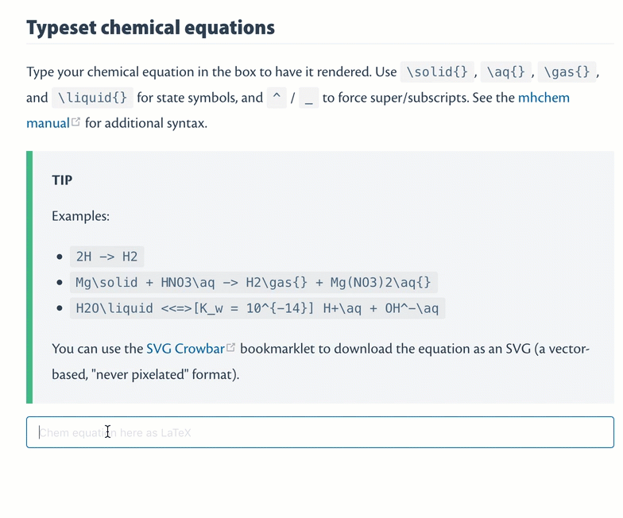

# A Grand Sandbox

[[toc]]

## Map

<ClientOnly>

<MapTopo v-bind:init_center="{lng:35.355660, lat:31.316457}" v-bind:init_zoom="10" >

<MapMarker :coord="[35.354400, 31.318961]" color='green' desc="Northern Palace built in 232 AD" />

</MapTopo>

</ClientOnly>

## Markdown features

### Table of contents

### Checkbox

[ ] Unfilled checkbox
[x] filled checkbox

### Footnote

#### Inline

Here is an inline note.^[Inlines notes are easier to write, since you don't have to pick an identifier and move down to type the note.]

#### Separate

Here is a footnote reference.[^1]

[^1]: Here is the footnote.

### Attributes / Classes

Through Markdown-it-attrs[^2].

### Abbreviations

*[HTML]: Hyper Text Markup Language
*[W3C]: World Wide Web Consortium

The HTML specification is maintained by the W3C.

[^2]: [NPM package](https://www.npmjs.com/package/markdown-it-attrs)

### Images

### Videos

Youtube

Vimeo

### Sup/superscript

23^rd^ October is Chemistry Day.

H~2~O is water.

<!-- ## Bootstrap-vue components -->

### Tabs

:::: tabs cache-lifetime="10" :options="{ useUrlFragment: false }"

::: tab "Question" id="first-tab"
Question content here
:::

::: tab Hint id="second-tab"
Hint content here
:::

::: tab Solution
Solution content here
:::

::::

## Element UI components

From Element UI.[^EUI]

[^EUI]: [Element UI documentation](http://element.eleme.io/?ref=madewithvuejs.com#/en-US/component/installation)

### Cards with headers

<el-card class="box-card">
  

    Card name
    <el-button style="float: right; padding: 3px 0" type="text">Operation button</el-button>
  

  

    {{'List item ' + o }}
  

</el-card>

### Stepped slider

<el-steps :active="2" align-center>
  <el-step title="Step 1" description="Some description"></el-step>
  <el-step title="Step 2" description="Some description"></el-step>
  <el-step title="Step 3" description="Some description"></el-step>
  <el-step title="Step 4" description="Some description"></el-step>
</el-steps>

### Icons

<i class="el-icon-edit"></i>

SVG icons

<vp-icon name="electron" />

### Buttons

<el-row>
  <el-button round>Round</el-button>
  <el-button type="primary" round>Primary</el-button>
  <el-button type="success" round>Success</el-button>
  <el-button type="info" round>Info</el-button>
  <el-button type="warning" round>Warning</el-button>
  <el-button type="danger" round>Danger</el-button>
</el-row>

### Tags

<el-tag>Tag One</el-tag>
<el-tag type="success">Tag Two</el-tag>
<el-tag type="info">Tag Three</el-tag>
<el-tag type="warning">Tag Four</el-tag>
<el-tag type="danger">Tag Five</el-tag>

<!-- ## LaTeX / Chem

<LaTeX formula="x^2 + y^2 + \cancel{pxy} = z^2 + \cancel{pxy}" />

<Chem formula="H+\aq{} + OH^{-}\aq{} <=>> H2O\liquid{}" />

At triple point, <Chem formula="H2O\solid{} <=> H2O\liquid{} <=> H2O\gas{}" inline />.

Physical units available with **pu** command. -->

## Animation with Haiku

<!-- <anim-snap /> -->

<!-- ## Animation with Lottie --- FORGET ABOUT IT

vue-lottie broken: TypeError. -->

<!-- <Anim /> -->

<!-- <iframe src="https://modest-booth-7d9598.netlify.com/anim/lottietest.html" height=600 width=600 frameborder=0 scrolling="no"></iframe>

No control from an iframe. -->

## 3D molecules

### Through jsmol
<!-- 
JSmol from iframe in public/jsmol/jsmol.html

<iframe src="https://modest-booth-7d9598.netlify.com/jsmol/jsmol.html" height=600 width=600 frameborder=0 scrolling="no"></iframe> -->

### Through 3dmol.js

<!-- From PDB.

<Molecule pdb="1bl8" /> -->

<!-- From PubChem.

<Molecule cid="2349" /> -->
<!-- 
From "local" file placed in /public/pdb/.

<Molecule url="https://modest-booth-7d9598.netlify.com/pdb/6c6p.pdb" /> -->

## Airtable pull

<!-- <AirtableTopic /> -->

## Local JSON pull

JSON path relative to component

<LocalJSON />

<!-- 

    <h2>{{i.first_name}} {{i.last_name}}</h2>
    

 -->

<!--  -->

<!-- ## Teacher toggle

<Teacher>

Teacher-only component, set on global $teacher

</Teacher> -->
<!-- 
<el-switch v-model="$teacher" active-text="Teacher" inactive-text="Student">
</el-switch>

Bug: switch does not seem to toggle -->

## Flowcharts / Gantt charts

### via Vis.js

<vis-timeline />
<vis-network />

### via Mermaid.js

<mermaid>
graph LR
    Start --> Stop
</mermaid>

## Custom components

<Duration time='60 min' />
<CompletionStatus v-bind:percentage=100 />
<PublishDate date="2019-03-20T03:54:07Z" />

## BabylonJS

<!-- <BabylonTest /> -->

## PDF

<!-- <PDF /> -->

## E-charts

<!-- <IA-Criteria /> -->
<!-- 
## GIF

 -->
